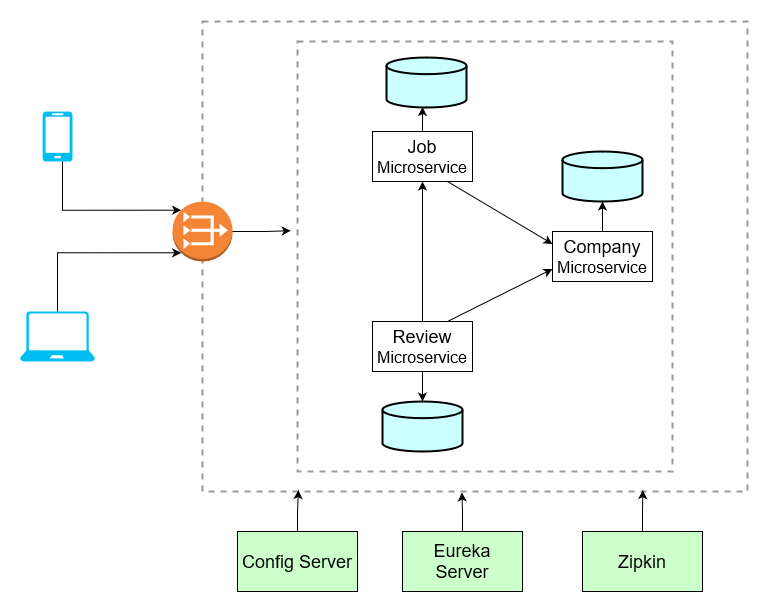

# Jobber: Distributed Job Portal Platform

## Overview
Jobber is a modern, full-stack, distributed job portal platform designed with microservices architecture. It leverages Java Spring Boot for the backend and React for the frontend, providing a scalable, resilient, and cloud-native solution for job listings, company management, and company reviews.

## Features
- **Microservices Architecture**: Decoupled services for jobs, companies, and reviews
- **Spring Boot Backend**: Java-based, robust, and production-ready
- **React Frontend**: Beautiful, responsive, and user-friendly UI
- **Service Discovery**: Eureka for dynamic service registration
- **API Gateway**: Spring Cloud Gateway for unified routing
- **Centralized Configuration**: Spring Cloud Config Server
- **Distributed Tracing**: Zipkin integration
- **Asynchronous Messaging**: RabbitMQ for event-driven communication
- **PostgreSQL**: Reliable, scalable database for all services
- **Docker & Kubernetes Ready**: Containerized and orchestratable

## Architecture


### Services
- **API Gateway** (`api-gateway`): Entry point for all client requests, routes to backend services
- **Service Registry** (`service-registry`): Eureka server for service discovery
- **Config Server** (`config-server`): Centralized configuration management
- **Job Service** (`job-service`): Manages job postings (CRUD, search)
- **Company Service** (`company-service`): Manages company profiles
- **Review Service** (`review-service`): Handles company reviews
- **Common Lib** (`common-lib`): Shared DTOs and utilities

### Infrastructure
- **RabbitMQ**: For asynchronous messaging between services
- **PostgreSQL**: Database for persistent storage
- **Zipkin**: Distributed tracing and monitoring

## Technologies Used
- **Java 17, Spring Boot 3.x, Spring Cloud 2023.x**
- **React (TypeScript, PWA template)**
- **Docker, Docker Compose, Kubernetes**
- **PostgreSQL, RabbitMQ, Zipkin**

## Getting Started

### Prerequisites
- Java 17+
- Maven 3.8+
- Node.js 18+
- Docker (for local development)
- (Optional) Minikube/Kubernetes for orchestration

### Clone the Repository
```bash
git clone https://github.com/eshaan-kapooswalla/Jobber.git
cd Jobber
```

### Backend Setup
1. **Build all services:**
   ```bash
   cd backend
   mvn clean install
   ```
2. **Run with Docker Compose:**
   ```bash
   docker compose up -d
   ```
   This will start PostgreSQL, RabbitMQ, Zipkin, and you can run the Spring Boot services from your IDE or terminal.

3. **Run all services (dev mode):**
   - Start `service-registry`, `config-server`, `api-gateway`, `job-service`, `company-service`, `review-service` (each has its own main class).

### Frontend Setup
1. **Install dependencies:**
   ```bash
   cd frontend
   npm install
   ```
2. **Start the React app:**
   ```bash
   npm start
   ```
   The app will be available at [http://localhost:3000](http://localhost:3000)

### API Endpoints
- **Jobs:** `/jobs`
- **Companies:** `/companies`
- **Reviews:** `/reviews`

All endpoints are accessible via the API Gateway at `http://localhost:8085`.

## Deployment
- **Docker Compose:** For local development and testing
- **Kubernetes:** For production-grade orchestration (see `bootstrap/` and `services/` for manifests)

## Contributing
Pull requests are welcome! For major changes, please open an issue first to discuss what you would like to change.

## License
This project is licensed under the MIT License.

---

**Jobber** is a showcase of modern distributed systems and microservices best practices with Java and React. For questions or collaboration, contact [eshaank@my.yorku.ca](mailto:eshaank@my.yorku.ca). 